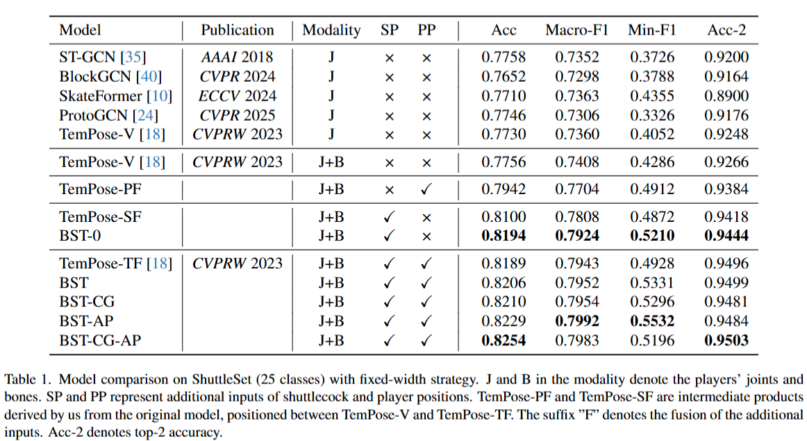
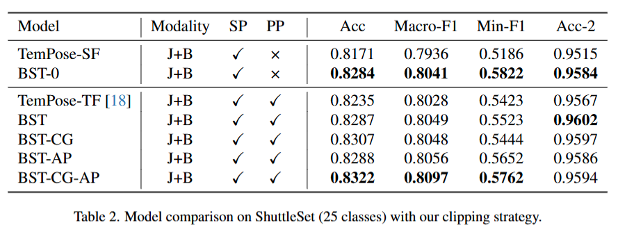
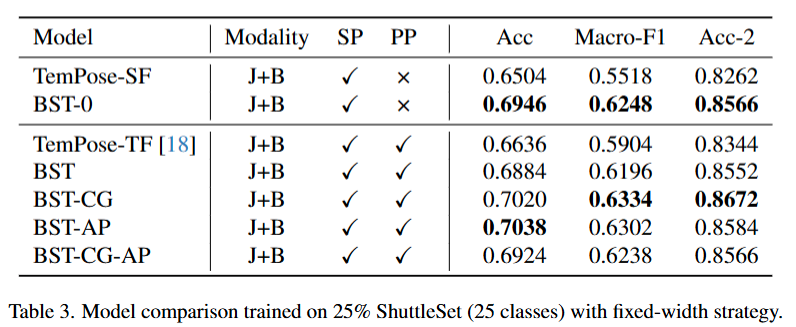
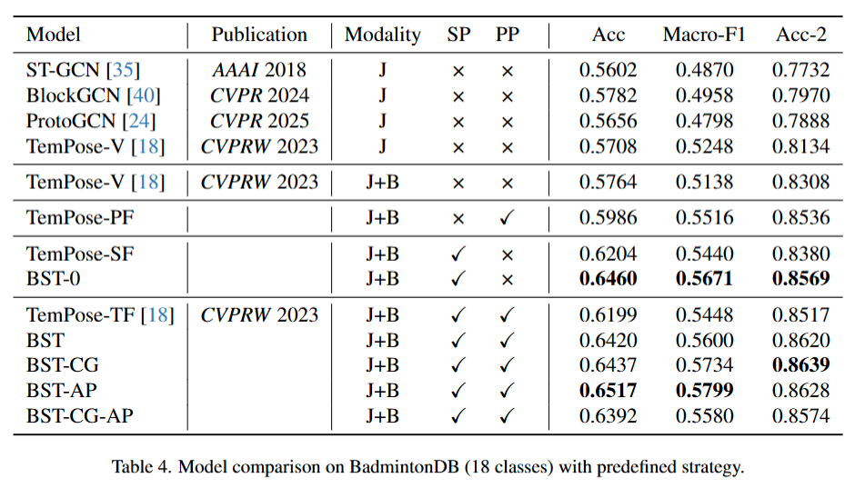
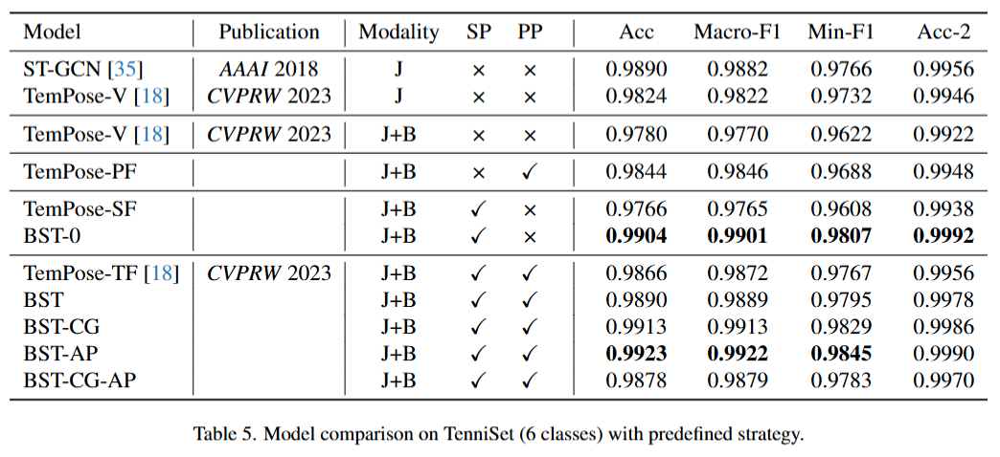
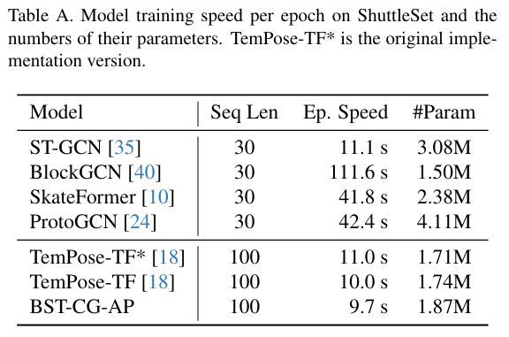
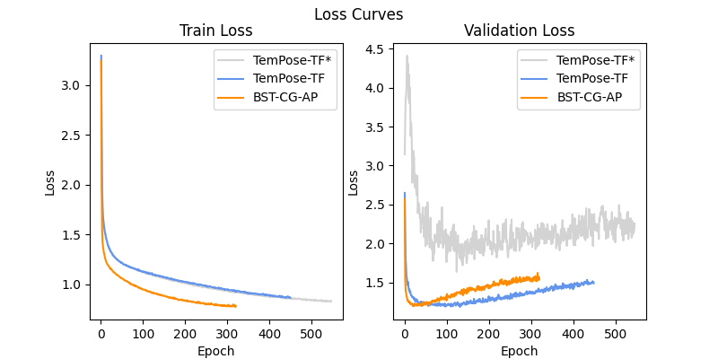

# BST: Badminton Stroke-type Transformer for Skeleton-based Action Recognition in Racket Sports
[](https://arxiv.org/abs/2502.21085)

[](https://www.python.org/downloads/) [](https://pytorch.org/) [](https://numpy.org/news/#releases)

## Abstract
Badminton, known for having the fastest ball speeds among all sports, presents significant challenges to the field of computer vision, including player identification, court line detection, shuttlecock trajectory tracking, and player stroke-type classification. In this paper, we introduce a novel video clipping strategy to extract frames of each player's racket swing in a badminton broadcast match. These clipped frames are then processed by three existing models: one for Human Pose Estimation to obtain human skeletal joints, another for shuttlecock trajectory tracking, and the other for court line detection to determine player positions on the court. Leveraging these data as inputs, we propose Badminton Stroke-type Transformer (BST) to classify player stroke-types in singles. To the best of our knowledge, experimental results demonstrate that our method outperforms the previous state-of-the-art on the largest publicly available badminton video dataset (ShuttleSet), another badminton dataset (BadmintonDB), and a tennis dataset (TenniSet). These results suggest that effectively leveraging ball trajectory is a promising direction for action recognition in racket sports.

**Keywords:** Deep learning, Transformer, Skeleton-based Action Recognition, Stroke classification, Badminton, Racket sports

## Results
### Results on ShuttleSet (25 classes)




### Results on BadmintonDB (18 classes)


### Results on TenniSet (6 classes)


## Training Speed
- On a NVIDIA RTX 4090 setup, **BST-CG-AP** trains slightly faster than **TemPose-TF**:

    

- The following figure also shows that training **BST-CG-AP** converges faster than **TemPose-TF**:

    

> [!NOTE]
> **TemPose-TF\***, the official implementation from TemPose's authors, uses the same TCN object to handle player positions and shuttlecock, so it causes the performance gap compared to **TemPose-TF**.

## Inference
I've provided an example of inferring code in `stroke_classification/main_on_shuttleset/bst_infer.py`.
> [!CAUTION]
> Make sure your input data is normalized in the same way as in `stroke_classification/preparing_data/prepare_train_on_<dataset_name>.py`.
> - `normalize_shuttlecock`
>   - Normalized by the video resolution.
>   - Each element is in the range [0, 1].
> - `normalize_joints`
>   - Use relative coordinates within the player's bounding box, with its top-left corner as the origin.
>   - Normalized by the diagonal distance of the player's bounding box by default.
>   - `center_align` default is `True`. $\Rightarrow$ Make the center of the bounding box to be the new origin.
>   - Each element is in the range [-0.X, 0.X].
> - `normalize_position`
>   - Convert the points of feet from camera coordinates to court coordinates.
>   - Calculate the midpoint between them.
>   - Normalized by court boundary (in court coordinate, which is a rectangle).
>   - Each element is in the range [0, 1] on a badminton dataset. For a tennis dataset, it may slightly out of this range.

## Weights
- [Weights trained on ShuttleSet](https://drive.google.com/drive/folders/1D4172WZDJWPvpJdpaHDhy_cA-s8F-zR5?usp=sharing)
- [Weights trained on BadmintonDB](https://drive.google.com/drive/folders/1RJgh6q_6M4OgpYU6VNuMaJ9YR8U8Y-li?usp=sharing)
- [Weights trained on TenniSet](https://drive.google.com/drive/folders/1VZQNrN3XDm8czzFNRxVjGA2dtSojMxDA?usp=sharing)
> [!TIP]
> How to choose a great weight file? Please see `results_and_images/result_table.xlsx`.

## Reproducing the Results
There are three main steps:
1. [Generating Stroke Clips](#generating-stroke-clips)
2. [Data Preprocessing](#data-preprocessing)
3. [Training Classification Models](#training-classification-models)

Since the process before training is time-consuming, I have provided the non-collated .npy files (use [the last step in `stroke_classification/preparing_data/prepare_train_on_<dataset_name>.py`](#prepare_train) to collate these .npy files) in `stroke_classification/preparing_data` folders:
- ShuttleSet_data_merged (25 classes)
    - (`seq_len=30`) [dataset_npy](https://drive.google.com/file/d/12Hv0abFNXeOmC4JiFtndPQz6KdCBqdHx/view?usp=sharing)
    - (`seq_len=30`) [dataset_3d_npy](https://drive.google.com/file/d/1cVeieEehUeZ8FFZJq-KlP8ERBUy-Z50E/view?usp=sharing)
    - (`seq_len=100`) [dataset_npy_between_2_hits_with_max_limits](https://drive.google.com/file/d/1k_6yFUh3xgF6emSyWc-qcTvf_0cRghzq/view?usp=sharing)
- ShuttleSet_data (35 classes)
    - (`seq_len=30`) [dataset_npy](https://drive.google.com/file/d/1396RVvMxdUzMztiKA7leUvBJM95EF9LP/view?usp=sharing)
    - (`seq_len=30`) [dataset_3d_npy](https://drive.google.com/file/d/1hIR1lFprfme1KWpB_uXPKUqd11TmBVxM/view?usp=sharing)
    - (`seq_len=100`) [dataset_npy_between_2_hits_with_max_limits](https://drive.google.com/file/d/1kMBQsJojb7IGkAb08s2of5pZ5qtpSzNU/view?usp=sharing)
- BadmintonDB_data
    - (`seq_len=72`) [dataset_npy](https://drive.google.com/file/d/1dlEntSV6NBAKtU7_SsXEpvUk8lK9lPTb/view?usp=sharing)
- TenniSet_data
    - (`seq_len=100`) [dataset_npy](https://drive.google.com/file/d/1bdl1N-1m8hA4tYn5CtQ2y8iUsfb7Ew-i/view?usp=sharing)

### Generating Stroke Clips
#### ShuttleSet (35 classes)
(In `ShuttleSet` folder)
1. Download the videos from links in `set/match.csv` and put them into `raw_video` folder.
    - `flaw_shot_records.csv` shows some errors in the original [ShuttleSet](https://github.com/wywyWang/CoachAI-Projects/tree/main/ShuttleSet), so please use the modified version in this repository.
    - Append each video ID to the front of its name, such as `<ID> - <name>.mp4`.
2. Modify `my_raw_video_resolution.csv` to the resolutions you downloaded.
3. Run `gen_my_dataset.py` 6 (2 players x 3 splitted sets) times, and please check the following settings in the code each time:
    - `out_root_dir`: output root directory.
    - `player`: Top / Bottom.
    - `set_name`: train / val / test.
    - `type_ls`: each element should be the same class name as in ShuttleSet.
    - `strategy`: please check if it matches the `out_root_dir` or not.
4. Remove all the clips labeled "removed" in `flaw_shot_records.csv`.
> [!IMPORTANT]
> Before the next step, please make a copy of `Top_小平球`, `Bottom_小平球` and `未知球種` folders to another place, if you want to generate ShuttleSet (25 classes) later.
5. Move all clips in `Top_小平球` or `Bottom_小平球` to `未知球種`, which means "none" type, and delete these empty folders.
6. Make sure the total number of the clips each type is the same as that shown in `class_total.xlsx`.

#### ShuttleSet (25 classes)
(In `ShuttleSet_merged` folder)
> [!TIP]
> We don't need to generate the clips again if we have done the generating process for ShuttleSet (35 classes).

Go check the total number of the clips each merged type in `class_total.xlsx`.

#### BadmintonDB (18 classes)
(In `BadmintonDB` folder)
1. Download the videos from links in their repository [BadmintonDB](https://github.com/kwban/badminton-db) and put them into `raw_video` folder.
2. Modify `my_raw_video_resolution.csv` to the resolutions you downloaded.
3. Run `gen_my_dataset.py`.

#### TenniSet (6 classes)
(In `TenniSet` folder)
1. Download the videos from their repository [TenniSet](https://github.com/HaydenFaulkner/Tennis) and put them into `videos` folder.
2. Run `gen_my_dataset.py`.
> [!NOTE]
> Since they provide video files directly, the downloaded video resolutions must be the same. We don't need `my_raw_video_resolution.csv` here.

### Data Preprocessing
1. (Only TenniSet needs) Make sure your [TennisCourtDetector](https://github.com/yastrebksv/TennisCourtDetector) works well.
2. Make sure your shuttlecock tracking model works well, you can choose the one you like:
    - [TrackNetV3 (using attension)](https://github.com/alenzenx/TrackNetV3) $\Leftarrow$ used in this paper.
    - [TrackNetV3 (with rectification module)](https://github.com/qaz812345/TrackNetV3).
3. Make sure your [MMPose](https://github.com/open-mmlab/mmpose/tree/main) works well.
    - Set your `venv_prepare_train` virtual environment first for running Human Pose Estimation (HPE) successfully.
    - See `prepare_train_env.txt` as an example based on my setup.
<a id="prepare_train"></a>
4. Enter `stroke_classification` folder, and activate your `venv_prepare_train` virtual environment.

    ```
    cd stroke_classification
    preparing_data/venv_prepare_train/Scripts/activate
    ```
5. Run 3 or 4 steps in `prepare_train_on_<dataset_name>.py` individually.
    ```
    python preparing_data/prepare_train_on_<dataset_name>.py
    ```
    1. Run court detection (only for TenniSet).
    2. Run ball tracking model.
        - Check the parameters are being passed into your tracking model.
    3. Run HPE model and save 3 kinds of inputs for classification model from each clip to .npy files.
        - I don't recommend using 3D poses because there are still some bugs using MMPose 3D pose API.
    4. Collate these .npy files into several big .npy files.
        - Set `seq_len` properly for the specific dataset.

6. Deactivate your `venv_prepare_train` virtual environment.

    ```
    deactivate
    ```
Thus, we have collated .npy files now.

### Training Classification Models
(In `stroke_classification` folder)

Run each `<architecture_name>_main.py` for training, validating, testing each model, and please check hyper-parameters:
```
python main_on_<dataset_name>/<architecture_name>_main.py
```
- `hyp.n_classes`: should be the same as in your dataset.
- `hyp.seq_len`: should be the same as in your dataset.
- `hyp.pose_style`
    - `J_only`: modality `J` in this paper.
    - `JnB_bone`: modality `J+B` in this paper.
- `use_3d_pose`: `False` for 2D, `True` for 3D.
- `train_partial`: `1` for the whole training set.
- `model_name`
    - `BST_0`: **BST-0** in this paper.
    - `BST_CG`: **BST-CG** in this paper.
    - `BST_AP`: **BST-AP** in this paper.
    - `BST_CG_AP`: **BST-CG-AP** in this paper.
- `additional_model_info`: to distinguish your model weights.
- `serial_no`: to distinguish your model weights when trying different initial weights.

> [!NOTE]
> **BST-CG** is identical to **BST-1** from the arXiv preprint v2.  
> **BST-AP** is identical to **BST-2** from the arXiv preprint v2.  
> **BST-CG-AP** is identical to **BST-3** from the arXiv preprint v2.

## Citation
```
@misc{chang2025bstbadmintonstroketypetransformer,
      title={BST: Badminton Stroke-type Transformer for Skeleton-based Action Recognition in Racket Sports}, 
      author={Jing-Yuan Chang},
      year={2025},
      eprint={2502.21085},
      archivePrefix={arXiv},
      primaryClass={cs.CV},
      url={https://arxiv.org/abs/2502.21085}, 
}
```

## References
- Shuttlecock Trajectory
    - [TrackNetV3 (using attention)](https://github.com/alenzenx/TrackNetV3)
    - [TrackNetV3 (with rectification module)](https://github.com/qaz812345/TrackNetV3)
- Human Pose Estimation
    - [MMPose](https://github.com/open-mmlab/mmpose/tree/main)
- Court Detection (if the dataset does not contain court information)
    - [MonoTrack](https://github.com/jhwang7628/monotrack)
    - [TennisCourtDetector](https://github.com/yastrebksv/TennisCourtDetector)
- Classification Models
    - [ST-GCN](https://github.com/yysijie/st-gcn)
    - [BlockGCN](https://github.com/ZhouYuxuanYX/BlockGCN)
    - [SkateFormer](https://github.com/KAIST-VICLab/SkateFormer)
    - [ProtoGCN](https://github.com/firework8/ProtoGCN)
    - [TemPose](https://github.com/MagnusPetersenIbh/TemPose-BadmintonActionRecognition)
- Dataset
    - [ShuttleSet](https://github.com/wywyWang/CoachAI-Projects/tree/main/ShuttleSet)
    - [BadmintonDB](https://github.com/kwban/badminton-db)
    - [TenniSet](https://github.com/HaydenFaulkner/Tennis)
